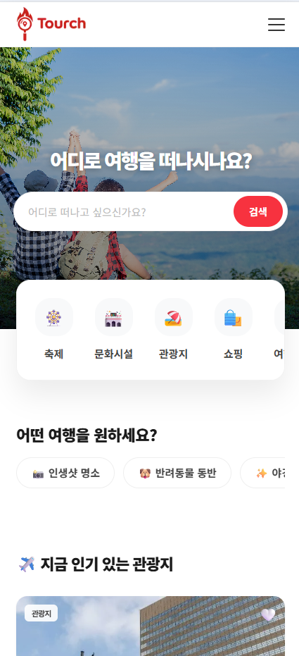
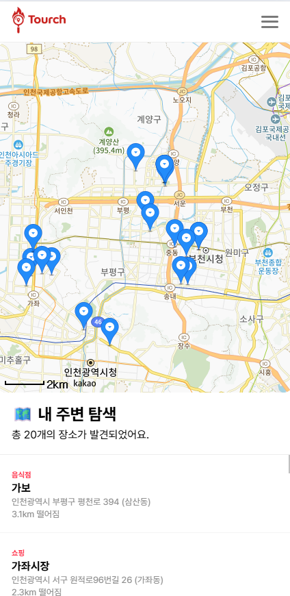
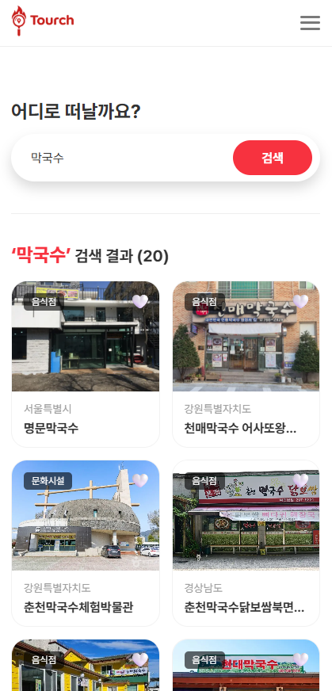
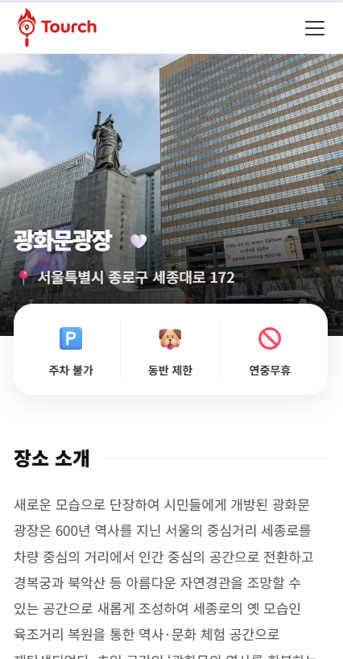

# 📍 Tourch (투치)
> **"터치 한 번으로 발견하는 대한민국의 숨은 명소"**
> 한국관광공사 공공데이터를 활용한 사용자 맞춤형 여행 정보 큐레이션 서비스

---

## 🔗 Link
- **Live Demo**: [https://tour-eight-gamma.vercel.app/]
- **Github**: [https://github.com/EunsungGIT/Tourch]

---

## 🚀 Project Overview
- **개발 기간**: 2025.10 - 2025.12 (1인 개발)
- **핵심 목표**: 방대한 공공 데이터를 사용자의 위치와 관심사에 맞춰 직관적으로 전달하고, Firebase를 통한 개인화된 경험(찜하기) 제공.
- **핵심 키워드**: `Next.js`, `Server Components`, `Real-time DB`, `Location-based Service`

---

## 🛠 Tech Stack

### Frontend
- **Framework**: Next.js (App Router)
- **Language**: TypeScript
- **Styling**: CSS Modules
- **Library**: Swiper (Slider), Framer Motion (Animation)

### Backend & API
- **Backend**: Firebase (Authentication, Firestore)
- **API**: 한국관광공사 TourAPI 4.0, Kakao Maps SDK
- **Deployment**: Vercel

---

## 🌟 Key Features & Tech Insights

### 1. 위치 기반 실시간 주변 탐색 (`/map`)
- **Geolocation API**: 브라우저의 현재 좌표를 획득하여 실시간 위치 서비스 제공.
- **다중 마커 렌더링**: `useRef`를 활용해 지도 인스턴스를 유지하며 반경 5km 이내의 데이터를 마커로 시각화하여 고성능 지도 UI 구현.

### 2. 데이터 주도형 상세 정보 큐레이션 (`/detail`)
- **동적 필드 매핑 로직**: 관광 타입별로 상이한 응답 필드(주차, 애견동반 등)를 `FieldMap` 객체로 구조화하여 중복 없는 선언적 렌더링 구현.
- **문맥 기반 주변 정보 추천**: 현재 장소의 좌표를 기반으로 주변 맛집, 숙소 등을 실시간 API로 호출하는 `Near` 컴포넌트 구현.

### 3. 실시간 유저 데이터 동기화
- **Auth Guard**: `onAuthStateChanged`를 통해 유저 인증 상태를 추적하고, 비로그인 유저의 기능 접근 제한 및 UX 분기 처리.
- **Real-time Sync**: Firestore의 `onSnapshot` 리스너를 활용해 사용자가 찜 버튼을 누르는 즉시 `Wishlist` 페이지와 실시간 데이터 동기화.

### 4. 효율적인 데이터 페칭 및 보안
- **API 보안**: API Key 및 Firebase 설정값을 환경 변수(`.env`)로 관리하여 클라이언트 노출 방지.
- **성능 최적화**: 자주 바뀌지 않는 데이터에 `revalidate` 옵션을 적용하여 서버 부하 감소 및 렌더링 속도 개선.

---

### 💡 Technical Challenges & Solutions

- **Next.js 비동기 파라미터**: Server Components에서 `params`와 `searchParams`를 Promise 타입으로 다루는 최신 스펙을 적용하여 데이터 안정성 확보.
- **메모리 관리 (Memory Leak)**: 실시간 리스너(`onSnapshot`, `onAuthStateChanged`) 사용 시, 컴포넌트 언마운트 시점에 구독 해제(Unsubscribe)를 명시하여 자원 낭비 방지.
- **반응형 애니메이션**: CSS `transform`과 `transition`을 활용하여 모바일 네비게이션의 슬라이드 효과를 구현하고, 가로 스크롤 이슈를 `overflow-x: hidden`으로 해결.

---

### 🛠 Trouble Shooting

#### 1. 공공데이터 API 이미지 엑박(Broken Image) 처리
- **문제**: API에서 제공하는 일부 이미지 URL이 만료되어 UI에 엑박(Broken Link)이 노출되는 문제 발생.
- **해결**: 데이터 바인딩 단계에서 `firstimage` 유무를 체크하고, 이미지 로드 실패 시 준비된 로고 이미지를 표시하도록 `Fallback` 로직을 구현하여 시각적 일관성 유지.

#### 2. Mixed Content (HTTP/HTTPS) 보안 이슈
- **문제**: HTTPS 배포 환경에서 HTTP API 호출 시 브라우저 보안 정책으로 인해 요청이 차단됨.
- **해결**: API 엔드포인트를 HTTPS로 강제 전환하고, 서버 컴포넌트에서 데이터 패칭을 수행하여 브라우저 규제를 우회함과 동시에 보안성 강화.

---

## 📸 Screen Shots
| 메인 페이지 | 내 주변 탐색 (지도) | 검색 결과 | 상세 페이지 |
| :---: | :---: | :---: | :---: |
|  |  |  |  |

---

## 📁 Directory Structure

```text
src/
├── app/                        # Next.js App Router 및 페이지 구성
│   ├── detail/[id]/            # 관광지 상세 페이지 (동적 라우팅)
│   ├── join/                   # 회원가입 페이지
│   ├── list/                   # 관광지 목록 페이지
│   ├── login/                  # 로그인 페이지
│   ├── map/                    # 내 주변 탐색 (지도) 페이지
│   ├── search/                 # 키워드 검색 페이지
│   ├── wish/                   # 찜 목록(Wishlist) 페이지
│   ├── globals.css             # 전역 스타일 설정
│   ├── layout.tsx              # 공통 레이아웃 (헤더, 푸터 포함)
│   ├── loading.tsx             # 전역 로딩 UI
│   └── page.tsx                # 메인(홈) 페이지
├── components/                 # 재사용 가능한 UI 컴포넌트 및 스타일
│   ├── Card.tsx                # 관광지 카드 아이템 (Card.module.css 포함)
│   ├── DetailMap.tsx           # 상세 페이지용 단일 지도
│   ├── Footer.tsx              # 하단 푸터 (Footer.module.css 포함)
│   ├── FullMap.tsx             # 메인 지도 서비스 컴포넌트
│   ├── Header.tsx              # 상단 네비게이션 (Header.module.css 포함)
│   ├── Infinite.tsx            # 무한 스크롤 처리 컴포넌트
│   ├── Like.tsx                # 찜하기 버튼 및 로직
│   ├── Near.tsx       # 상세 페이지 내 반경 기반 주변 시설 추천
│   ├── Curation.tsx        # 메인 페이지 테마별 큐레이션 키워드 칩
│   ├── Slider.tsx          # Swiper 기반의 메인 섹션 슬라이더
│   └── SearchInput.tsx         # 검색창 입력 컴포넌트
└── lib/                        # 외부 서비스 라이브러리 설정
    ├── api.ts                  # 한국관광공사 TourAPI 호출 로직
    └── firebase.ts             # Firebase Authentication & Firestore 설정